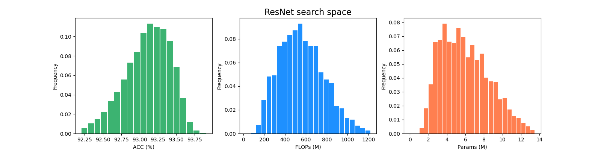

# Channel-Bench-Macro

This repository includes the benchmark and code for Channel-Bench-Macro. Channel-Bench-Macro is the corresponding benchmark of [NAS-Bench-Marco](https://github.com/xiusu/NAS-Bench-Macro), which serves for channel number search / channel pruning algorithms.

Channel-Bench-Macro is a channel benchmark on macro search space. The Channel-Bench-Macro consists of 16384 X 2 networks for MobileNet and ResNet search space. We provide the test accuracies, parameters, FLOPs, and training logs on CIFAR-10 dataset.

**Each architecture in Channel-Bench-Macro is trained from scratch isolatedly.**


## Benchmark

All the evaluated architectures are stored in file Resuls_MobileNet.json and Results_ResNet.json with the following format:

```
{
    arch1: {
        acc: [float, float, float], // the test accuracies of three independent training
        mean: float, // mean accuracy of three test accuracies
        std: float, // the standard deviation of test accuracies
        params: int, // parameters
        flops: int, // FLOPs 
    },
    arch2: ......
}

```

## Search Space


The search space of Channel-Bench-Macro is conducted with 7 independent layers for MobileNet and ResNet, respectivel, the width of skip line is directly derived from the corresponding independent layer. Each layer in contains 4 candidate widths: [0.25, 0.5, 0.75, 1.0], which amounts to 4^7 = 16384 networks for each search space (MobileNet and ResNet).

## Network structure

Search space of MobileNet for Channel-Bench-Macro. The ratio for each MobileNet block is set to 6 as default, which influences the maximum channel of the second conv in MB block.
n | input | block | channel | stride
------------ | ------------- | ------------- | ------------- | ------------- 
1 | 32 X 32 X 3 | 3 X 3 conv  | 128 | 2
2 | 16 X 16 X 128 | MB block  | 128 | 1
1 | 16 X 16 X 128 | MB block  | 256 | 2
1 | 16 X 16 X 256 | MB block  | 256 | 1
1 | 16 X 16 X 256 | 1 X 1 conv  | 1024 | 1
1 | 16 X 16 X 1024 | global avgpool  | - | -
1 | 16 X 16 X 1024 | FC  | 10 | -

For the ResNet search space, the ResNet block is introduced as RS block for abbreviate.
n | input | block | channel | stride
------------ | ------------- | ------------- | ------------- | ------------- 
1 | 32 X 32 X 3 | 3 X 3 conv  | 256 | 2
2 | 16 X 16 X 256 | RS block  | 256 | 1
1 | 16 X 16 X 256 | RS block  | 512 | 2
2 | 16 X 16 X 512 | RS block  | 512 | 1
1 | 16 X 16 X 512 | global avgpool  | - | -
1 | 16 X 16 X 512 | FC  | 10 | -

## Statistics of histograms of networks

Accuracy, FLOPs, and Parameters of the proposed Channel-Bench-Macro w.r.t all architectures for ResNet and MobileNet search space.




## Requirements

```
torch>=1.0.1
torchvision
```

## Reproduce the Results
### Training scripts
cd train_folder

python train.py

### Training logs
If you need training logs to help your research, i.e., you need the training accuracy or test accuracy of architectures from all training epochs. You can download the training logs of all architectures of MobileNet ([Google Drive](https://drive.google.com/drive/folders/1-bNfZuU00ZavhH8_ojlPPtJHTpNuBu9G?usp=sharing)) and ResNet([Google Drive](https://drive.google.com/drive/folders/1-bNfZuU00ZavhH8_ojlPPtJHTpNuBu9G?usp=sharing)) for a detailed analysis.

## Citation

If you find that NAS-Bench-Macro helps your research, please consider citing it:

```
@misc{su2021bcnet,
      title={BCNet: Searching for Network Width with Bilaterally Coupled Network}, 
      author={Xiu Su and Shan You and Fei Wang and Chen Qian and Changshui Zhang and Chang Xu},
      year={2021},
      eprint={2105.10533},
      archivePrefix={arXiv},
      primaryClass={cs.CV}
}

@misc{su2021vision,
      title={Vision Transformer Architecture Search}, 
      author={Xiu Su and Shan You and Jiyang Xie and Mingkai Zheng and Fei Wang and Chen Qian and Changshui Zhang and Xiaogang Wang and Chang Xu},
      year={2021},
      eprint={2106.13700},
      archivePrefix={arXiv},
      primaryClass={cs.CV}
}
```
